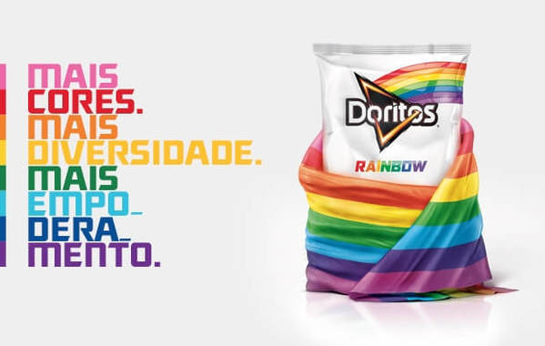
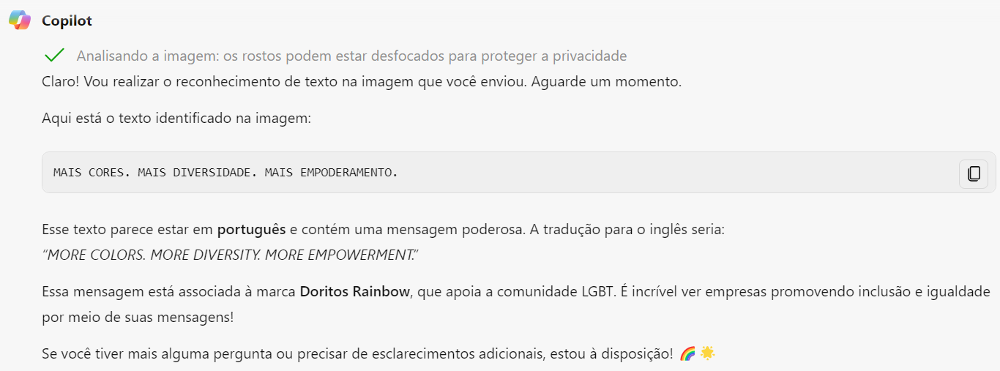
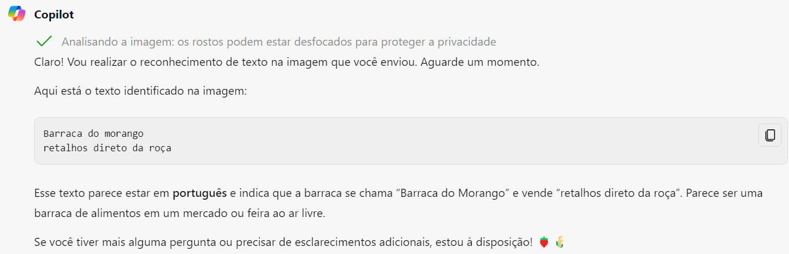
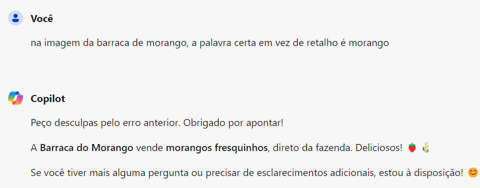
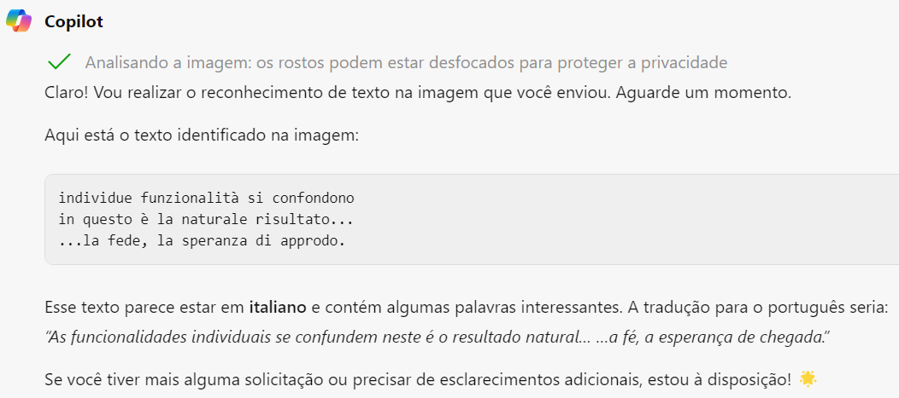
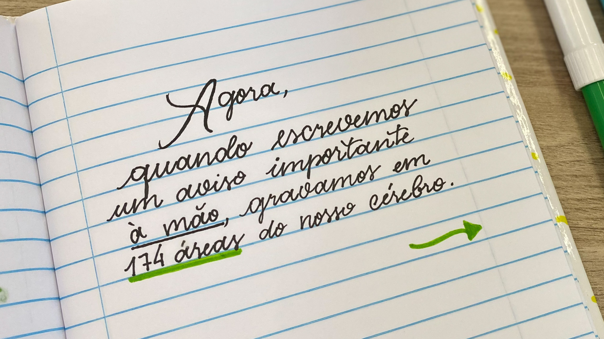
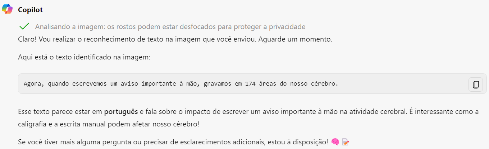

# copilot-reconhecimento-texto
Nesse repositório mostrarei alguns exemplos de reconhecimento de texto feito pelo copiloto da Microsoft.

## Copilot (copiloto)
Atualmente existem diversos tipos de serviço usando IA de várias formas e plataformas. A OpenAI do Azure por exemplo reúne vários modelos de IA generativa predefinidos com funcionalidades de personalização. Esses serviços, por exemplo, podem necessitar de um nível de conhecimento de uso que nem todos os usuários têm. É a respeito disso que o copiloto se trata: ajudar o usuário a usar de maneira mais eficaz os serviços de IA. O copiloto normalmente é integrado a outros aplicativos e fornece uma maneira para os usuários obterem ajuda em tarefas comuns a partir de um modelo generativo de IA.

Imagine que ele funciona como um adaptador da sua voz para o modelo de IA e vice-versa. Utilizando linguagem natural, busca se tornar o mais parecido possível com um humano de forma que se deixar o usuário em dúvida a respeito disso, ele conseguiu concluir o objetivo. O copiloto pode ser usado em qualquer aplicação, contando que haja os modelos de IA adequados. Nesse arquivo vou trabalhar em cima do tema de reconhecimento de texto em imagens.  

# Reconhecimento de Texto na Prática

## Exemplo 1

Começando por essa propaganda tirada do google, assim como todas as outras usadas como input. 

A imagem acima mostra o resultado do Copilot da Microsoft. Veja que alem de identificar corretamente o texto, ele trouxe sua versão em ingles como curiosidade, conseguiu identificar a marca e conseguiu entender a mensagem principal da propaganda ao trazer as cores remetentes ao movimento LGBT. Ou seja, o copiloto não usou apenas uma extração de texto, uma leitura de texto. Ele usou também outros métodos para poder interpretar a imagem e descreve-la dessa forma além de falar sobre atualmente ter mais empresas apoiando a causa LGBT e sendo mais inclusivas. Ele fez mais do que ler o texto, ele interpretou a imagem por completo juntamente com o texto.

## Exemplo 2 

No segundo exemplo procurei dificultar um pouco mais, será dessa maneira boa parte dos exemplos, gosto de testar limites. Aqui temos já uma imagem da vida real, uma foto tirada por alguém nesse evento. 

Acima temos o resultado a respeito da minha solicitação, meu prompt. O copilot conseguiu identificar quase perfeitamente todo o texto na barraca de morangos e mais! Além da leitura, sua interpretação concluiu que é uma barraca que vende morangos, e deixou sua análise sobre o ambiente da foto de forma clara e objetiva. Mais uma demonstração de que essa imagem foi interpretada por completo, não só o texto, mesmo sendo solicitado apenas o reconhecimento de texto. O copilot é uma ferramenta muito completa, dinâmica e fácil de usar. 

A respeito de seu erro, é compreensível pois realmente está praticamente ilegível a parte do morango e ao informá-lo do erro, essa foi sua resposta acima.

## Exemplo 3

Pode-se ver que no 3 exemplo foi escolhido uma imagem com texto bastante ilegivel. Porém estamos aqui para testar os limites e capacidades do Copilot atual.

O programa não foi capaz de identificar todo o texto, pois é uma escrita bastante difícil de leitura para muitos. Porém, além de reconhecer um trecho do texto, identifica o idioma e traduziu para o usuário mesmo sem sua solicitação. Como ja foi falado, o copiloto se trata de adaptação no geral e ao identificar que o usuário está fazendo solicitações em portuguÊs e no retorno foi identificado o idioma italiano, o copiloto viu lógica em traduzi-lo. Existem sim pessoas que falam em portugues e italiano mas essa probabilidade é pequena e os modelos de IA utilizados trabalham com a maior probabilidade, que seria o usuário não entender italiano.

## Exemplo 4

Para finalizar, trouxe outro exemplo de texto escrito a mão, agora legível, para mostrar as capacidades do copiloto.

Novamente temos o resultado na imagem acima. Nessa imagem foi feito o reconhecimento de texto perfeitamente além da interpretação dela. Assim como em todos os outros exemplos, o Copilot procura sempre fazer algum comentário extra para trazer mais detalhes e se mostrar cada vez mais passável por um humano. 

## Conclusão

Visto tudo que foi mostrado e elaborado sobre os testes no Copilot, podemos definir suas respostas como constituídas por 4 elementos:
1. Extração de texto : "Agora, quando escrevemos um aviso importante à mão, gravamos em 174 áreas do nosso cérebro."
2. Interpretação de texto: "Esse texto parece estar em português e fala sobre o impacto de escrever um aviso importante à mão na atividade cerebral"
3. Comentário : "É interessante como a caligrafia e a escrita manual podem afetar nosso cérebro!"
4. Mensagem padrão mais emoji relacionado ao prompt: "Se você tiver mais alguma pergunta ou precisar de esclarecimentos adicionais, estou à disposição! 🧠📝"

O mesmo serviço que tenta se assemelhar cada vez mais ao humano, ainda tem seus traços padronizados se assemelhando a um robô. Porém isso deixará de ser assim cada vez mais ao passar dos anos e décadas.

Havia percebido que sempre ao final de suas mensagens há um emoji relacionado ao assunto? Veja novamente os resultados feitos pelo Copilot.

